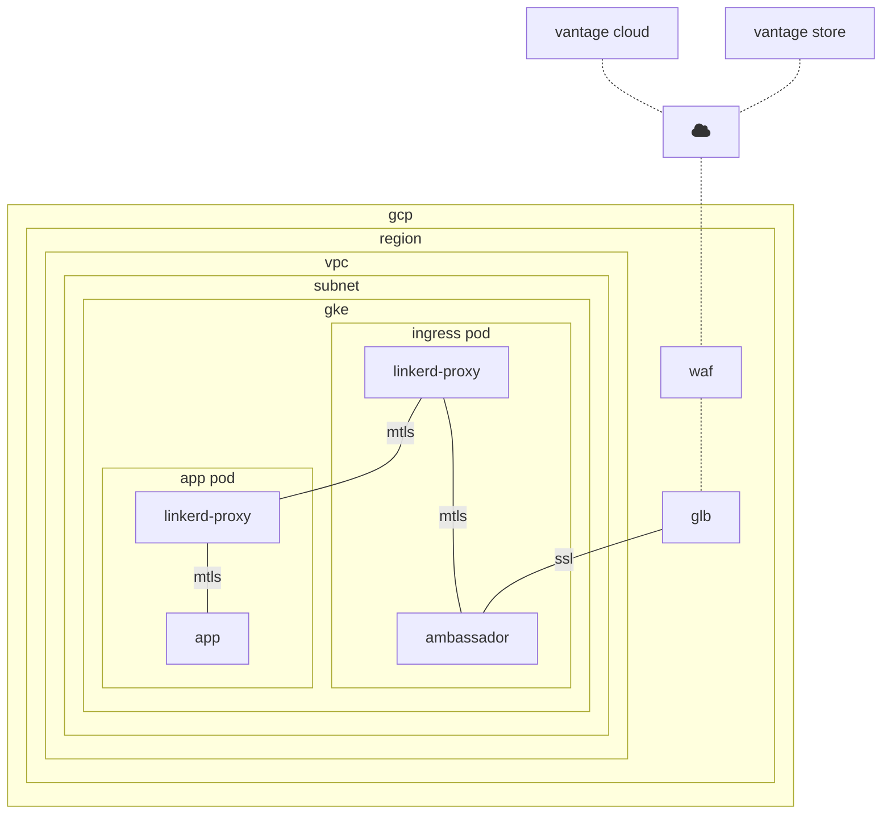

```mermaid
graph TD
    V1[vantage cloud] -.- V3
    V2[vantage store] -.- V3
    V3[fa:fa-cloud] -.- R1

    subgraph gcp
    
    subgraph "region"
    R1[waf] -.- R2
    R2[glb] ---|ssl| A1
    
    subgraph "vpc"
    
    subgraph "subnet"

    subgraph "gke"
    
    L1[linkerd-proxy] ---|mtls| L2

    subgraph "ingress pod"
    L1[linkerd-proxy] ---|mtls| A1
    A1[ambassador]
    end

    subgraph "app pod"
    L2[linkerd-proxy] ---|mtls| C1
    C1[app]
    end

    end
    end
    end
    end
    end
```