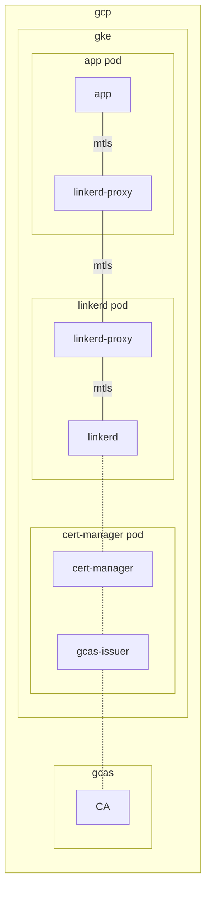

```mermaid
graph BT
    subgraph "gcp"

    subgraph "gcas"
    A1[CA]
    end
    
    subgraph "gke"

    subgraph "cert-manager pod"
    M1[gcas-issuer] -.- A1
    M2[cert-manager] -.- M1
    end
    
    subgraph "linkerd pod"
    L1[linkerd] -.- M2
    L2[linkerd-proxy] ---|mtls| L1
    end

    subgraph "app pod"
    C1[app] ---|mtls| L3
    L3[linkerd-proxy] ---|mtls| L2
    end

    end
    end
```