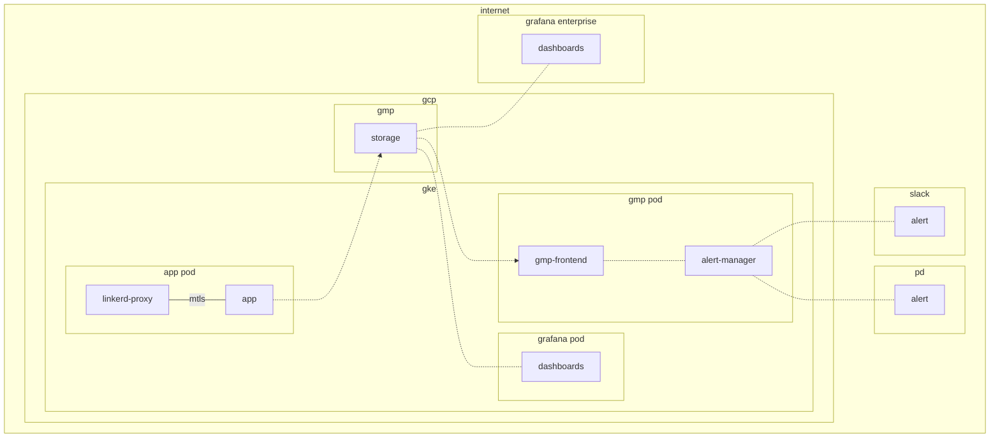

```mermaid
graph TD
    subgraph "internet"
    subgraph "grafana enterprise"
    G2[dashboards]
    end

    subgraph "slack"
    A1[alert]
    end

    subgraph "pd"
    A2[alert]
    end

    subgraph "gcp"
    
    Q2[storage] -.-> I2
    Q2[storage] -.- G1
    subgraph "gmp"
    Q2[storage] -.- G2
    end

    subgraph "gke"

    I1[alert-manager] -.- A1
    subgraph "gmp pod"
    I1[alert-manager] -.- A2
    I2[gmp-frontend] -.- I1
    end

    subgraph "grafana pod"
    G1[dashboards]
    end

    subgraph "app pod"
    L1[linkerd-proxy] ---|mtls| C1
    C1[app] -.-> Q2
    end

    end
    end
    end
```