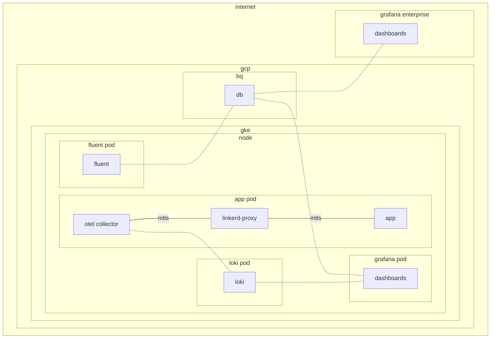

```mermaid
graph TD
    subgraph "internet"
    subgraph "grafana enterprise"
    G2[dashboards]
    end

    subgraph "gcp"
    
    Q2[db] -.- G1
    subgraph "bq"
    Q2[db] -.- G2
    end

    subgraph "gke"

    subgraph "node"
    
    subgraph "fluent pod"
    Q1[fluent] -.- Q2
    end

    subgraph "grafana pod"
    G1[dashboards]
    end

    subgraph "loki pod"
    T1[loki] -.- G1
    end

    subgraph "app pod"
    O1[otel collector] ---|mtls| L1
    O1[otel collector] -.- T1
    L1[linkerd-proxy] ---|mtls| C1
    C1[app]
    end

    end
    end
    end
    end
```