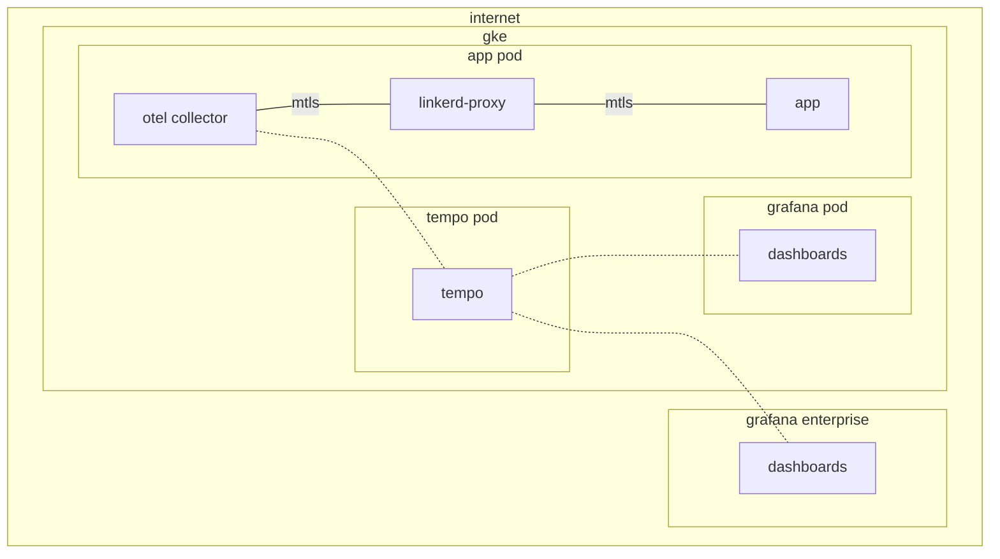

```mermaid
graph TD
    subgraph "internet"

    subgraph "grafana enterprise"
    G2[dashboards]
    end

    subgraph "gke"

    subgraph "grafana pod"
    G1[dashboards]
    end

    T1[tempo] -.- G2
    subgraph "tempo pod"
    T1[tempo] -.- G1
    end

    subgraph "app pod"
    O1[otel collector] ---|mtls| L1
    O1[otel collector] -.- T1
    L1[linkerd-proxy] ---|mtls| C1
    C1[app]
    end

    end
    end
```