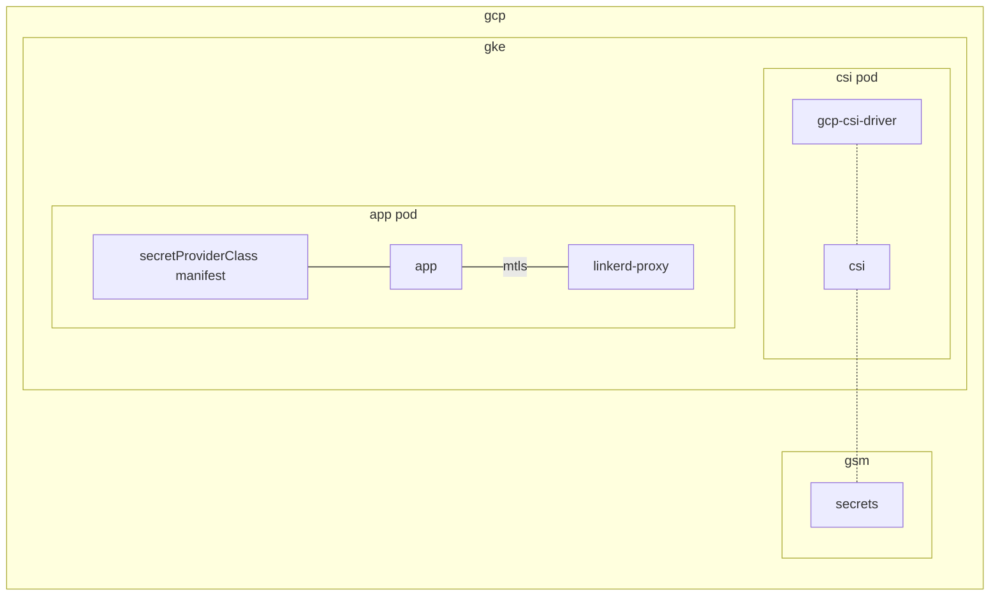

```mermaid
graph BT
    subgraph "gcp"

    subgraph "gsm"
    A1[secrets]
    end
    
    subgraph "gke"

    subgraph "csi pod"
    M1[csi] -.- A1
    M2[gcp-csi-driver] -.- M1
    end
    
    subgraph "app pod"
    S3[secretProviderClass manifest] --- C1
    C1[app] ---|mtls| L3
    L3[linkerd-proxy]
    end

    end
    end
```